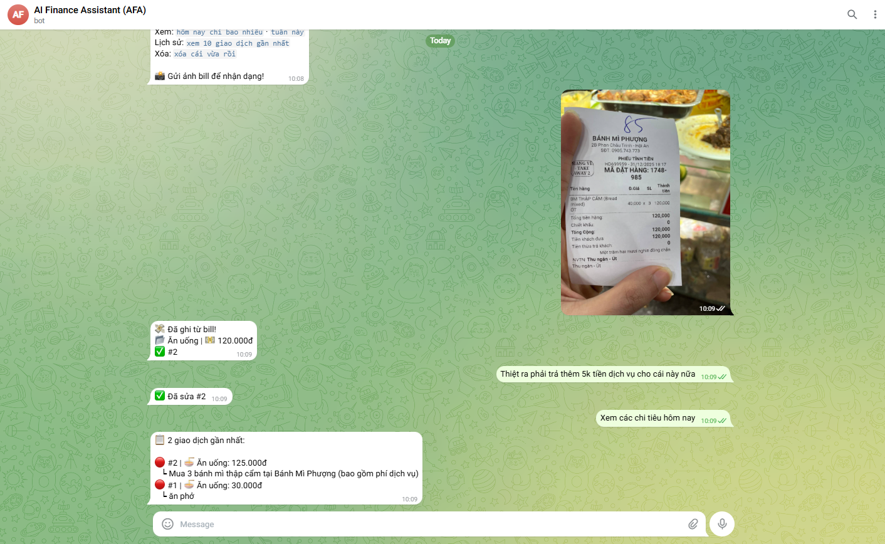
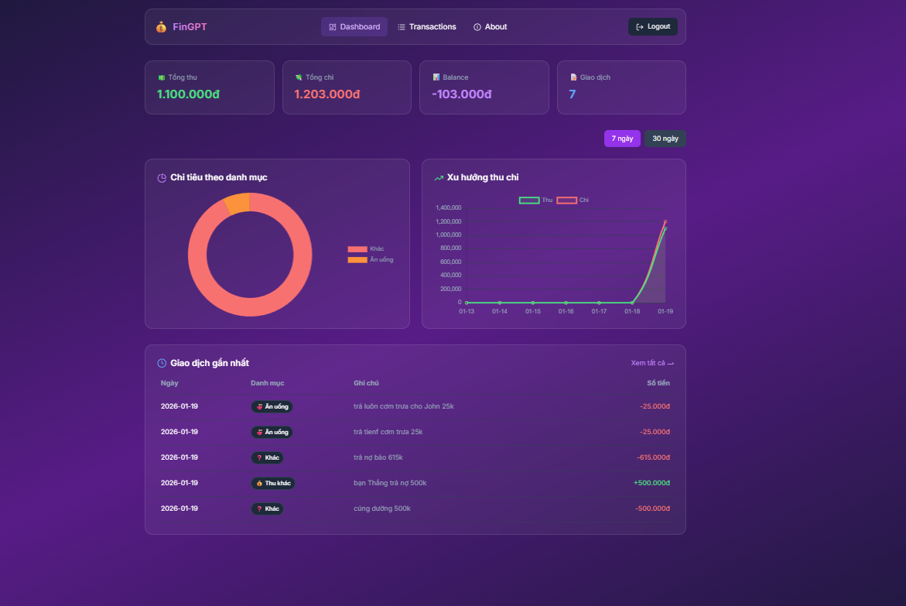

# FinGPT V2 - Intelligent Finance Telegram Bot

<p align="center">
  
  
</p>

FinGPT V2 is an AI-powered personal finance management bot for Telegram. It uses Google's Gemini AI to parse natural language and receipt images into structured financial transactions. The V2 architecture introduces a **Multi-tenant System** with a built-in Flask Web Dashboard, allowing you to host multiple standalone bots for different users on a single server using a local SQLite database.

## 🌟 Key Features

* **Natural Language Processing:** Just text the bot naturally (e.g., "Breakfast 30k, lunch 50k yesterday") and let the AI parse the date, amount, and category automatically.
* **General Purpose Chat:** If your message doesn't contain financial data, the bot seamlessly transitions into a conversational AI, answering general questions or providing financial advice.
* **Receipt Image Recognition:** Send a picture of a receipt or bank transfer snapshot, and the AI will extract the transaction details.
* **Multi-tenant Architecture:** Host multiple unique Telegram bots from the same source code. Each user manages their own bot instance.
* **Web Dashboard:** A responsive UI where users can manage their bot token, view transaction history, edit records, and track their budget via charts.
* **100% Local Storage:** Runs entirely on local SQLite, ensuring top-tier data privacy and zero dependency on external cloud databases.

## 🚀 Deployment Guide

The easiest and recommended way to deploy FinGPT V2 is by using Docker to ensure all dependencies and isolated environments are handled properly.

### Prerequisites
* A Virtual Private Server (VPS) running Linux (Ubuntu/Debian recommended).
* Docker & Docker Compose installed.
* A Telegram Bot Token from [@BotFather](https://t.me/BotFather).
* A Google Gemini API Key from [Google AI Studio](https://aistudio.google.com).

### Step 1: Clone and Configure

1. Clone the repository to your server:
   ```bash
   git clone https://github.com/your-repo/telegram-fin-gpt.git
   cd telegram-fin-gpt
   ```

2. Create the environment configuration file:
   ```bash
   cp .env.example .env
   ```

3. Edit `.env` with your actual API keys and preferences:
   ```ini
   # Essential configuration
   GEMINI_API_KEY="your_google_gemini_api_key"
   
   # Dashboard security
   DASHBOARD_SECRET="generate_a_random_secure_string_here"
   ADMIN_SESSION_PASSWORD="your_admin_password"
   
   # Miscellaneous
   DEBUG=False
   ```

### Step 2: Build and Run with Docker

Fire up the database, the background service manager, and the web dashboard in one single command:

```bash
sudo docker compose up -d --build
```

You can follow the logs to ensure everything booted properly:
```bash
sudo docker compose logs -f
```

### Step 3: Register Your Personal Bot

1. Open your web browser and navigate to the Web Dashboard:
   👉 **`http://localhost:5000/login`** (or replace `localhost` with your server IP if deploying remotely).
2. Input a generic Username and Password, and click **Register**.
3. Once logged in, go to the **Settings** menu.
4. Fill in your **Telegram Bot Token** (From BotFather).
5. Fill in your **Telegram User ID** so that strangers cannot interact with your bot. (You can find your ID by messaging `@userinfobot` on Telegram).
6. Click **Save**. The dashboard features an automatic **Connection Test** to verify if your token and ID are valid.

> **Note:** Whenever you add or change your Bot Token in the Dashboard, the system will dynamically restart your bot's polling service in the background within 15 seconds. You do **not** need to manually restart Docker!

## 💬 How to Use the Bot

Once the system is running and fully configured, open Telegram and send `/start` to your bot.

Try sending mixed messages to record multiple transactions simultaneously:
* `"Bought a coffee for 30k this morning and grabbed lunch for 50k"`
* `"Salary arrived 10M."`
* `"Undo the last one, I meant 20M."`

Or just ask it general questions:
* `"What are some good rules for saving money?"`
* `"Hello, how's it going?"`

## 🛠 Tech Stack

* **Language:** Python 3.11
* **Frameworks:** Aiogram 3.x (Telegram Bot), Flask + Flask-Login (Web Dashboard)
* **AI Model:** Google GenAI SDK (Gemini)
* **Database:** SQLite & aiosqlite
* **Containerization:** Docker & Docker Compose
